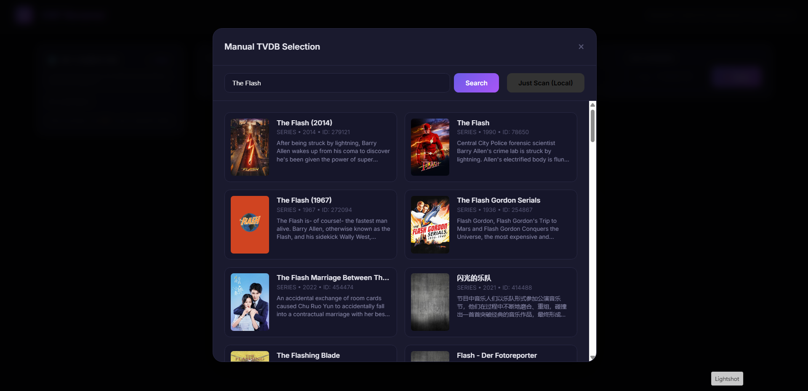
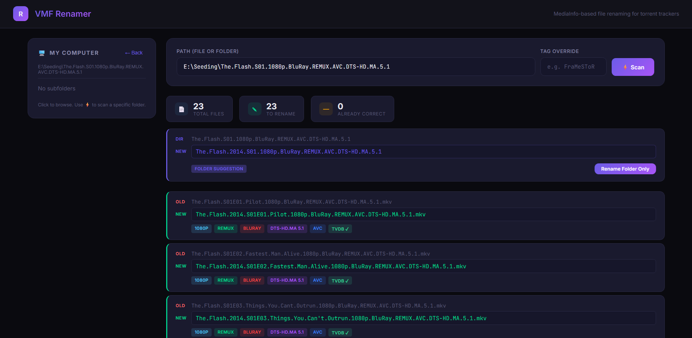
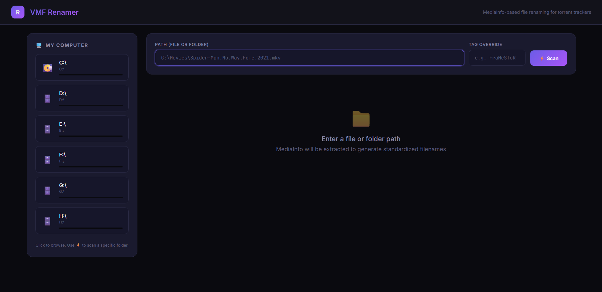

# VMF Renamer

A powerful, MediaInfo-based file renamer designed for torrent trackers (PTP/AnimeBytes style). Now with integrated **TVDB v4 API** support for precise metadata enrichment of TV shows and Movies.

## Features

- **MediaInfo Extraction**: Automatically detects resolution, source (BluRay, WEB-DL, etc.), HDR/UHD, and high-quality audio codecs (DTS-HD MA, TrueHD Atmos, etc.).
- **TVDB v4 Integration**:
  - Interactive search and selection for the correct show/movie.
  - Automatic season/episode identification with episode titles.
  - Smart title sanitization (auto-stripping duplicate years).
- **Batch Processing**: Rename entire series folders or single files with one click.
- **Modern Web Interface**: Clean, dark-themed UI with real-time feedback and posters.

## Screenshots

### 1. Unified Search & Scan
When you click **Scan**, the application suggests a title and lets you search TVDB or skip for a local-only scan.



### 2. Standardized Results
Results are formatted according to scene/tracker standards, enriched with TVDB metadata (Title, Year, Episode Name) and MediaInfo.



### 3. Folder-Level Enrichment
Easily rename an entire folder and its contents based on the first file's TVDB match.



## Installation

1. Clone the repository.
2. Install dependencies:
   ```bash
   pip install -r requirements.txt
   ```
3. Copy `.env.example` to `.env` and add your `TVDB_API_KEY`.
4. Run the application:
   ```bash
   python app.py
   ```
5. Open `http://localhost:1102` in your browser.

## Configuration

- Edit `renamer_logic.py` to customize the naming template.
- Ensure `MediaInfo` (CLI) is installed and in your system PATH.

---
*Built with ❤️ for the archiving community.*
